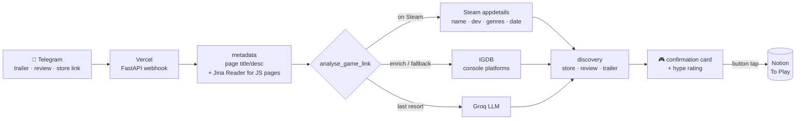

# 🎮 Game Backlog Bot

Share a game link on Telegram — a **trailer**, a **review**, or a **store page** — and it
lands in your Notion *"To Play"* database, fully tagged: developer, genres, platforms,
release date, a store link, a review, and how hyped you are.

The hard part isn't the Telegram plumbing — it's turning a *messy, ambiguous* link into
*correct, structured* data. A YouTube title like `"over the hill – Steam Next Fest Demo
Trailer"` has to become the right game (not the playtest, not a same-named game), with a
release date you can trust and a review link that points at the correct title. This bot
resolves that by combining several free data sources and trusting each only for what it's
actually authoritative about.



## How a link becomes a game

`pipeline.analyse_game_link` resolves each field from the source that's actually
authoritative for it:

| Source | Trusted for | Why |
| --- | --- | --- |
| **Steam** store API | name, developer, genres, release date | The appid is unambiguous, so there's no wrong-game risk. Found from the URL, or by an exact-name search that skips playtests/demos. |
| **IGDB** | console platforms; whole-game fallback | Steam only reports desktop. IGDB fills in Switch/PS/Xbox — but only when its match is clearly the same game. |
| **Groq** (LLM) | last-resort extraction | For the rare game neither store recognises. |
| **Jina Reader** | rendering JS-heavy pages | Xbox/Nintendo/PlayStation/Instagram return a shell page to a plain fetch; Jina renders them so we get the real title + store date. |
| **Metacritic / Steam / DuckDuckGo** | review + trailer links | Metacritic's slug is deterministic; Steam's own reviews page is a guaranteed-correct fallback for unreleased games. |

**Release dates are never fabricated.** A precise day is only written when Steam, an IGDB
*exact* entry, or the store page provides one. A game known only to the year/quarter
("Q1 2026", "Coming soon") is saved as *Unreleased* with no invented date — an early version
guessed dates and got them wrong, so the rule is now "exact or nothing".

**Every enrichment layer is optional.** With no IGDB/Groq/Jina keys the bot still resolves
any game that's on Steam; each missing source just removes one fallback.

## Project structure

The whole backend is the `game_bot` package; `api/index.py` is a thin Vercel entrypoint.

```
game_bot/
├── config.py       env vars + shared constants
├── text_utils.py   JSON / string helpers (incl. tolerant LLM-JSON parsing)
├── telegram.py     Telegram Bot API calls
├── llm.py          Groq chat-completions client
├── metadata.py     page-metadata fetch (+ Jina Reader JS fallback)
├── mapping.py      genre / platform / date / title normalisation
├── steam.py        Steam store API (appdetails + search)
├── igdb.py         IGDB game-database client
├── discovery.py    store-page / review / trailer lookups
├── pipeline.py     analyse_game_link — orchestrates the sources
├── notion.py       persist a game to the "To Play" database
└── bot.py          FastAPI app, webhook, and interaction handlers
api/index.py        Vercel entrypoint (re-exports game_bot.bot:app)
tests/              unit + integration tests (HTTP mocked with respx)
```

## Tech stack

Python · FastAPI · httpx (async) · Vercel serverless · Notion API · Groq (LLM) ·
IGDB · Steam store API · Jina Reader · pytest + respx.

## Setup

```bash
pip install -r requirements.txt -r requirements-test.txt
cp .env.example .env      # fill in the required keys (see below)
```

**Required:** `GROQ_API_KEY`, `NOTION_API_KEY`, `NOTION_DB_GAME`, `SECRET_KEY`,
`TELEGRAM_BOT_TOKEN`, `TELEGRAM_USER_ID`.
**Optional:** `TWITCH_CLIENT_ID`/`TWITCH_CLIENT_SECRET` (IGDB), `JINA_API_KEY`,
`GROQ_MODEL_FAST`/`GROQ_MODEL_CHAT`. See [`.env.example`](.env.example).

The Notion integration must be shared with the "To Play" database. Its schema:
`Name` (title), `Developer` (text), `Genre` / `Platform` (multi-select), `Status` /
`Hype` (select), `Release Date` (date), `Store` / `Review` / `Video` (url).

## Run, test, deploy

```bash
uvicorn game_bot.bot:app --reload      # run locally
pytest -q                              # 120+ tests, all HTTP mocked
```

Deploys to Vercel on push (`api/index.py` is the function). Point your Telegram
webhook at `https://<deployment>/api/telegram`.

## Design decisions worth calling out

- **Right source for the right field.** Rather than trusting one API end-to-end, each field
  comes from the source that can't be wrong about it (appid over fuzzy name search; store
  page over LLM guesses for dates).
- **Graceful degradation.** Optional keys are genuinely optional — the pipeline branches on
  what's configured and always produces a usable result.
- **Tolerant LLM parsing.** `safe_json_loads` repairs common malformed-JSON cases and the
  caller retries once, so a single bad completion can't drop a save.
- **Model portability.** Groq model IDs are env-overridable, so a provider deprecation is a
  config change, not a redeploy — which is exactly what happened when Groq retired the
  Llama models.
- **Serverless routing shim.** A middleware restores the original request path from a query
  param, working around a Vercel rewrite that otherwise collapses every route to one path.

---

<sub>Repo/Vercel project are still named `link-organizer` — rename those in GitHub + Vercel
to match if you like; nothing in the code depends on the name.</sub>
